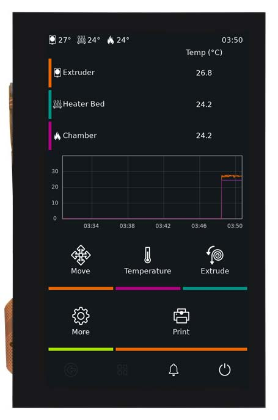
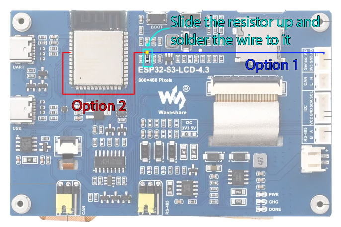

# gud-esp32s3

**English** | [Русский](README.ru.md)



Firmware for the **Waveshare ESP32-S3-Touch-LCD-4.3** (not the B version, SKU 25948) that turns the board into a USB display for Linux.
On the Type-C1 port (native USB) the host sees it as:

- **GUD (Generic USB Display)**, `1d50:614d`: a DRM card of the `gud` driver, 800x480, RGB565, LZ4, adjustable backlight
  (`/sys/class/backlight/cardN-USB-1-backlight`);
- **HID multitouch** (GT911, up to 5 contacts): `hid-multitouch`, a regular `/dev/input/eventN`.

The target use is `KlipperScreen` under X11 on a 3D printer host, but it works with any Linux host (tested with KDE Plasma 6).

Board schematic and 3D drawing: [Waveshare docs](https://docs.waveshare.com/ESP32-S3-Touch-LCD-4.3/Resources-And-Documents).

## What's inside

| Path | What it does |
|---|---|
| `main/gud/gud.c`, `gud.h` | GUD protocol, device side (from [notro/gud-pico](https://github.com/notro/gud-pico)) |
| `main/gud/gud_driver.c` | TinyUSB class driver: vendor control + bulk OUT, streaming LZ4 decoder, writing rectangles to the framebuffer |
| `main/usb_glue.c` | descriptors (HID + GUD), touch HID reports, reboot on a USB request, stack on core 1 |
| `main/lcd.c` | `esp_lcd` RGB panel: 14 MHz pclk, framebuffer in PSRAM + bounce buffer in internal SRAM |
| `main/board.c` | I2C, CH422G expander (resets, panel enable, USB_SEL), backlight PWM |
| `main/screen.c`, `ui.c` | `<NO SIGNAL>` screen, sleep on timeout, reaction to signal loss |
| `main/touch.c` | GT911 over I2C, polled every 5 ms |
| `bootloader_components/usb_dl_window` | USB download window in the bootloader (see "Flashing") |
| `components/tinyusb` | TinyUSB (espressif/tinyusb 0.21.x), device + HID + DWC2 only; no component registry needed |
| `tools/flash.sh`, `usb_flash.py` | flashing over the display's own cable (Type-C1), no buttons |
| `host/gud-module` | building the `gud` driver for kernels where it is disabled (Debian) |

### How the picture gets to the screen

The host doesn't send the whole screen, only the rectangles that changed (damage): a blinking cursor arrives as a
cursor-sized rectangle. Each rectangle is LZ4-compressed and arrives in a single USB transfer of any size (up to a full
frame): `max_buffer_size` equals the frame size, so the host never splits updates into strips, and even a window being
dragged appears at once instead of being drawn top to bottom.

On the board: USB -> receive buffer (PSRAM) -> LZ4 decompression -> its place in the framebuffer (PSRAM). The rest of
the frame is left untouched.

Why decompression goes through a 64 KB window in internal SRAM. The panel doesn't store the image: about 34 times a
second the controller copies the frame piece by piece from PSRAM into a small bounce buffer and feeds the screen from
there. If a piece isn't copied in time, the old contents of the buffer go to the screen - short strips of stale lines.
While decompressing, LZ4 keeps repeating data it has already produced (at most 64 KB back). When decompression wrote
straight into the framebuffer, those repeats were random PSRAM reads that took bandwidth away from the screen refresh.
Now the repeats are read from the window in internal memory, and finished pixels are only written to the framebuffer,
sequentially.

## Installation from a release

Download the image for your mounting from [Releases](https://github.com/Ponywka/gud-esp32s3/releases): one file
(bootloader + partition table + firmware) written at address `0x0`. `SHA256SUMS` lists checksums
(`sha256sum -c SHA256SUMS --ignore-missing`).

The variants differ only in the orientation of the firmware's own `<NO SIGNAL>` screen; pick the one that matches
the rotation set on the host (Xorg `Rotate`, see "Host"):

| File | `<NO SIGNAL>` orientation | Xorg `Rotate` |
|---|---|---|
| `gud-esp32s3-vX.Y.Z-ccw.bin` | portrait, picture turned 90 degrees counterclockwise | `CCW` |
| `gud-esp32s3-vX.Y.Z-cw.bin` | portrait, picture turned 90 degrees clockwise | `CW` |
| `gud-esp32s3-vX.Y.Z-ud.bin` | landscape, upside down | `UD` |
| `gud-esp32s3-vX.Y.Z-landscape.bin` | landscape, as the panel is | none |

### First flashing (from the stock Waveshare firmware)

Needed once, with the buttons. Either port works: **Type-C1** (USB) or **Type-C2** (UART).

1. Connect the board to the computer.
2. Put it into download mode: **hold BOOT, press and release RESET, release BOOT.**
3. Flash it in one of these ways:
   - **From the browser**, nothing to install (Chrome/Edge): open https://espressif.github.io/esptool-js/, press
     *Connect* and pick the board's port, leave the address at `0x0`, choose your `gud-esp32s3-vX.Y.Z-<variant>.bin`, press *Program*.
   - **esptool:**
     ```sh
     pip install esptool
     esptool.py --chip esp32s3 write_flash 0x0 gud-esp32s3-vX.Y.Z-ccw.bin
     ```
4. Press **RESET**: the screen shows `<NO SIGNAL>`.
5. Connect the board to the Linux host via **Type-C1** and set up the host (see "Host").

### Updating

- **Without buttons**, if this firmware is already installed: `tools/flash.sh gud-esp32s3-vX.Y.Z-ccw.bin` from this
  repository (needs Docker). The script reboots the display into download mode over the Type-C1 cable by itself.
- **Or the same way as the first flashing**: BOOT + RESET, then the browser or esptool.

A merged image also overwrites the settings area (NVS), so the saved brightness returns to the default.

## Building

ESP-IDF v5.3.x. Without installing IDF - in the official container:

```sh
docker run --rm -u $(id -u):$(id -g) -e HOME=/tmp -e IDF_COMPONENT_MANAGER=0 \
  -v $PWD:/project -w /project espressif/idf:v5.3.4 idf.py build
```

The board's module has 8 MB flash and 8 MB octal PSRAM (settings in `sdkconfig.defaults`). After editing
`sdkconfig.defaults`, delete `sdkconfig`, otherwise the old values override the new ones.

## Flashing

**The usual way - over the display's cable (Type-C1), no buttons:**

```sh
tools/flash.sh                             # build/ after idf.py build
tools/flash.sh gud-esp32s3-vX.Y.Z-ccw.bin  # or a merged image, at 0x0
```

The script sends the display vendor request `0xB0` (reboot); for ~1.5 s the bootloader hands the port to the
USB-Serial-JTAG controller (`303a:1001`); the script catches that window and flashes with esptool (in the same
`espressif/idf` container). The window opens on every boot, so if the firmware hangs (the watchdog reboots the board)
or doesn't answer, the script waits up to 5 minutes - just replug the cable.

**The first time, or if the USB path is broken - via Type-C2 (UART, CH343):**

```sh
# hold BOOT, press and release RESET, release BOOT
docker run --rm --device /dev/ttyACM0 -v $PWD:/project -w /project/build espressif/idf:v5.3.4 \
  python -m esptool --chip esp32s3 -p /dev/ttyACM0 --before no_reset --after hard_reset write_flash @flash_args
```

Auto-reset through the CH343's DTR/RTS is unreliable on this board, hence the buttons.
Don't connect Type-C1 and Type-C2 to different power sources at the same time: Type-C1 VBUS is wired straight to the
board's 5V rail.

### Preparing a release

Publishing a release on GitHub (with a new `vX.Y.Z` tag) is enough: the `Release images` workflow
(`.github/workflows/release.yml`) builds the images and attaches them to the release within a few minutes. A manual
run of the workflow (Actions -> Release images -> Run workflow) makes a test build and keeps it as an artifact.

Locally the same is done by:

```sh
tools/release.sh vX.Y.Z
```

Builds all four `<NO SIGNAL>` orientations (each in its own `build-release/<variant>/`, `build/` is left alone),
merges every one into `dist/gud-esp32s3-vX.Y.Z-<variant>.bin` and writes `dist/SHA256SUMS`. Without an argument the
version comes from `git describe`. Attach everything in `dist/` to the release. Separate images for those who flash by
hand are in `build-release/<variant>/` (`bootloader/bootloader.bin`, `partition_table/partition-table.bin`, `gud-esp32s3.bin`, addresses
in `flash_args`); flashing them separately keeps NVS, i.e. the saved brightness.

## Host

### The `gud` driver

```sh
modinfo gud                  # usually present in Armbian (CONFIG_DRM_GUD=m)
sudo modprobe gud
ls /sys/class/drm | grep USB # cardN-USB-1
```

Debian (6.12 and newer) has `CONFIG_DRM_GUD` disabled - build the module from `host/gud-module` (sources taken from kernel v6.12.107):

```sh
cd host/gud-module && make
# Secure Boot: sign with the DKMS key
sudo /usr/src/linux-headers-$(uname -r)/scripts/sign-file sha256 /var/lib/dkms/mok.key /var/lib/dkms/mok.pub gud.ko
sudo modprobe -a drm_kms_helper drm_shmem_helper lz4_compress
sudo insmod gud.ko
```

### Xorg / KlipperScreen

Armbian on a printer typically runs Xorg with the `fbdev` driver on `/dev/fb0` (the `gud` module's framebuffer emulation).
A 90 degree rotation goes into a separate file with its own `ServerLayout` (`Device` sections from different files are not merged):

`/etc/X11/xorg.conf.d/99-fbdev-rotate.conf`:

```
Section "Device"
    Identifier "gud-fbdev-rotated"
    Driver     "fbdev"
    Option     "fbdev"  "/dev/fb0"
    Option     "Rotate" "CCW"
EndSection

Section "Screen"
    Identifier "gud-screen"
    Device     "gud-fbdev-rotated"
EndSection

Section "ServerLayout"
    Identifier "gud-layout"
    Screen     "gud-screen"
EndSection
```

`/etc/X11/xorg.conf.d/99-gud-touch.conf`:

```
Section "InputClass"
    Identifier         "gud touch rotation"
    MatchUSBID         "1d50:614d"
    MatchIsTouchscreen "on"
    Option             "TransformationMatrix" "0 -1 1 1 0 0 0 0 1"
EndSection
```

| `Rotate` | `TransformationMatrix` |
|---|---|
| `CCW` | `0 -1 1 1 0 0 0 0 1` |
| `CW` | `0 1 0 -1 0 1 0 0 1` |
| `UD` | `-1 0 1 0 -1 1 0 0 1` |

Set the orientation of the firmware's own `<NO SIGNAL>` screen the same way: `BOARD_UI_ROTATION` in `main/board.h` (default `CCW`).

### KDE Plasma (Wayland)

Bind the touchscreen to the `USB-1` output: System Settings -> Touchscreen -> Target display.
KDE's brightness slider dims this display in software: KWin treats a USB display as external and doesn't use
`/sys/class/backlight`. For the physical brightness use `brightnessctl` or
`busctl call org.freedesktop.login1 /org/freedesktop/login1/session/auto org.freedesktop.login1.Session SetBrightness ssu backlight cardN-USB-1-backlight 50`.

## Screen and backlight

- At power-up: `<NO SIGNAL>`; if no picture arrives from the host within 60 s, the screen goes dark (`SCREEN_NO_SIGNAL_TIMEOUT_S`).
- A picture from the host turns the screen on, also from sleep. If the host goes away after it has shown a picture, the screen goes dark immediately.
- Host DPMS and brightness 0 turn off the backlight and the panel (the `DISP` line).
- Brightness 0-100 is saved to flash (NVS) 2 s after the last change; 0 is not saved. Default is 10%
  (`BOARD_BL_DEFAULT_PERCENT`).

### Board modification for brightness control

On the stock board the `DISP` line (CH422G EXIO2 via R21) enables both the panel (LCD connector pin 31) and the
MP3302 backlight driver (EN input via R10), so the backlight is on/off only. The MP3302 EN input does analog dimming
(~0.7 V dark .. ~1.4 V full brightness), so feeding it PWM through an RC filter is enough:

1. Disconnect R10 from the `DISP` line and feed IO6 to EN through 1 kOhm:
   - **R10 slid up** (as in the picture): the `DISP`-side lead of R10 comes off its pad, and the wire from IO6 is
     soldered straight to that lead. No extra resistor is needed - R10 (1 kOhm) stays between the wire and EN;
   - **R10 removed**: the wire goes through a separate ~1 kOhm resistor to the EN-side pad of R10 (it rings through to
     C12 and pin 4 of U2).
2. Take IO6 from one of two places: **route 1** - J6 pin 3 (the `Sensor AD` header), **route 2** - straight from the
   IO6 pin of the ESP32-S3 module.



Cyan - R10 and the direction to slide it; yellow dot - where the wire is soldered to the resistor;
blue line - route 1 (from the J6 header); red line - route 2 (from the ESP32-S3 module).

The `BOARD_BL_PWM_GPIO` constant in `main/board.h` is the GPIO number for the backlight PWM. The default is `6`
(J6 pin 3); such firmware also works on an unmodified board: brightness > 0 is full, 0 is off. The value `-1` disables
PWM entirely (IO6 stays free, `/sys/class/backlight` isn't created) - only needed if IO6 is used for something else on
an unmodified board.

## Notes

- The ESP32-S3's native USB is Full-Speed only (12 Mbit/s, ~1 MB/s in practice); LZ4 helps, but large screen
  changes still go at USB speed.
- The ESP32-S3's OUT endpoint packet counter is 7 bits wide: transfers are split at 127 packets (`GUD_EDPT_XFER_MAX_SIZE`).
- `esp_restart()` doesn't reset the USB controllers, so the bootloader hook resets them before the USB-Serial-JTAG window.
- `USB_SEL` (CH422G EXIO5) is always 0 = native USB; 1 would route GPIO19/20 to CAN.
- For panel debugging there is `lcd_draw_test_pattern()` (colour bars, grey ramp, 1 px border).
- The panel refreshes at ~34 Hz (14 MHz pclk); the host is told 34.

## License

The project's own code is MIT, see [`LICENSE`](LICENSE). Third-party code (TinyUSB, the GUD protocol from gud-pico,
the Linux `gud` driver) is under its own licenses, see [`THIRD_PARTY.md`](THIRD_PARTY.md).
