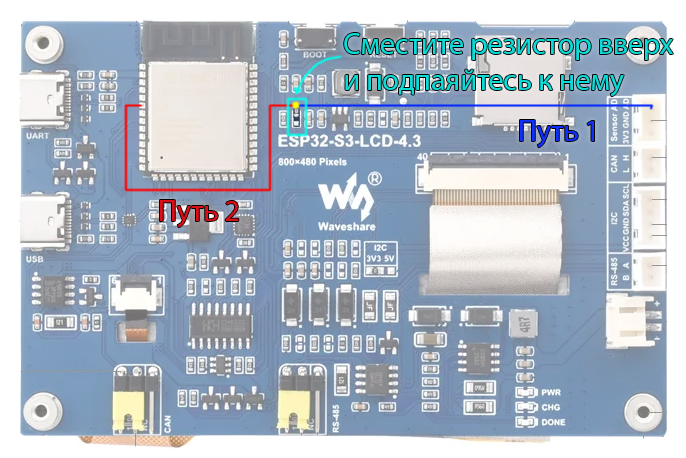

# gud-esp32s3

[English](README.md) | **Русский**


Прошивка для **Waveshare ESP32-S3-Touch-LCD-4.3** (не B, SKU 25948), превращающая плату в USB-дисплей для Linux.
Через порт Type-C1 (native USB) плата определяется хостом как:

- **GUD (Generic USB Display)**, `1d50:614d`: DRM-карта драйвера `gud`, 800x480, RGB565, LZ4, регулируемая подсветка
  (`/sys/class/backlight/cardN-USB-1-backlight`);
- **HID multitouch** (GT911, до 5 касаний): `hid-multitouch`, обычный `/dev/input/eventN`.

Целевое применение - `KlipperScreen` под X11 на хосте 3D-принтера, но работает с любым Linux-хостом (проверено с KDE Plasma 6).

Схема и 3D-чертёж платы: [вики Waveshare](https://docs.waveshare.com/ESP32-S3-Touch-LCD-4.3/Resources-And-Documents).

## Что внутри

| Путь | Что делает |
|---|---|
| `main/gud/gud.c`, `gud.h` | протокол GUD, сторона устройства (из [notro/gud-pico](https://github.com/notro/gud-pico)) |
| `main/gud/gud_driver.c` | класс-драйвер TinyUSB: vendor control + bulk OUT, потоковый LZ4-декодер, запись прямоугольников во фреймбуфер |
| `main/usb_glue.c` | дескрипторы (HID + GUD), HID-отчёты касаний, перезагрузка по USB-команде, стек на ядре 1 |
| `main/lcd.c` | RGB-панель `esp_lcd`: 14 МГц pclk, фреймбуфер в PSRAM + bounce-буфер во внутренней SRAM |
| `main/board.c` | I2C, расширитель CH422G (сбросы, включение панели, USB_SEL), ШИМ подсветки |
| `main/screen.c`, `ui.c` | экран `<NO SIGNAL>`, сон по таймауту, реакция на пропадание сигнала |
| `main/touch.c` | GT911 по I2C, опрос 5 мс |
| `bootloader_components/usb_dl_window` | окно загрузки по USB в загрузчике (см. «Прошивка») |
| `components/tinyusb` | TinyUSB (espressif/tinyusb 0.21.x), только device + HID + DWC2; реестр компонентов не нужен |
| `tools/flash.sh`, `usb_flash.py` | прошивка по кабелю дисплея (Type-C1), без кнопок |
| `host/gud-module` | сборка драйвера `gud` для ядер, где он выключен (Debian) |

### Как картинка попадает на экран

Хост присылает не весь экран, а только изменившиеся прямоугольники (damage): мигнул курсор - придёт прямоугольник
размером с курсор. Каждый прямоугольник сжат LZ4 и приходит одной USB-передачей, сколь угодно большой (до целого
кадра): `max_buffer_size` равен размеру кадра, поэтому хост не режет обновления на полосы, и даже перетаскиваемое окно
появляется сразу, а не прорисовывается сверху вниз.

На плате: USB -> буфер приёма (PSRAM) -> распаковка LZ4 -> нужное место фреймбуфера (PSRAM). Остальной кадр не трогается.

Почему распаковка идёт через окно 64 КБ во внутренней SRAM. Панель не хранит изображение: контроллер ~34 раза
в секунду по кусочку копирует кадр из PSRAM в маленький bounce-буфер и оттуда отдаёт его на экран. Если кусочек не
успели скопировать, на экран уходит старое содержимое буфера - короткие полоски из старых строк. LZ4 при распаковке
постоянно повторяет уже распакованные данные (не дальше 64 КБ назад). Когда распаковка шла прямо во фреймбуфер, это
были случайные чтения PSRAM, и они отнимали у вывода на экран пропускную способность. Теперь повторы читаются из окна
во внутренней памяти, а во фреймбуфер готовые пиксели только записываются подряд.

## Сборка

ESP-IDF v5.3.x. Без установки IDF - в официальном контейнере:

```sh
docker run --rm -u $(id -u):$(id -g) -e HOME=/tmp -e IDF_COMPONENT_MANAGER=0 \
  -v $PWD:/project -w /project espressif/idf:v5.3.4 idf.py build
```

Модуль платы - 8 МБ flash, 8 МБ octal PSRAM (настройки в `sdkconfig.defaults`). После правки `sdkconfig.defaults`
удалить `sdkconfig`, иначе старые значения перекроют новые.

## Прошивка

**Обычный способ - по кабелю дисплея (Type-C1), без кнопок:**

```sh
tools/flash.sh
```

Скрипт посылает дисплею vendor-запрос `0xB0` (перезагрузка), загрузчик на ~1.5 с отдаёт порт контроллеру
USB-Serial-JTAG (`303a:1001`), скрипт ловит это окно и шьёт через esptool (в том же контейнере `espressif/idf`).
Окно открывается при каждой загрузке, поэтому если прошивка зависла (сторожевой таймер перезагрузит плату) или
не отвечает - скрипт ждёт до 5 минут, достаточно переподключить кабель.

**Первый раз или если USB-путь сломан - через Type-C2 (UART, CH343):**

```sh
# BOOT зажать, RESET нажать и отпустить, BOOT отпустить
docker run --rm --device /dev/ttyACM0 -v $PWD:/project -w /project/build espressif/idf:v5.3.4 \
  python -m esptool --chip esp32s3 -p /dev/ttyACM0 --before no_reset --after hard_reset write_flash @flash_args
```

Автосброс через DTR/RTS моста CH343 на этой плате ненадёжен, поэтому кнопками.
Не подключать Type-C1 и Type-C2 к разным источникам одновременно: VBUS Type-C1 соединён с 5V-шиной платы напрямую.

## Хост

### Драйвер `gud`

```sh
modinfo gud                  # в Armbian обычно есть (CONFIG_DRM_GUD=m)
sudo modprobe gud
ls /sys/class/drm | grep USB # cardN-USB-1
```

В Debian (6.12 и новее) `CONFIG_DRM_GUD` выключен - собрать модуль из `host/gud-module` (исходники взяты из ядра v6.12.107):

```sh
cd host/gud-module && make
# Secure Boot: подписать ключом DKMS
sudo /usr/src/linux-headers-$(uname -r)/scripts/sign-file sha256 /var/lib/dkms/mok.key /var/lib/dkms/mok.pub gud.ko
sudo modprobe -a drm_kms_helper drm_shmem_helper lz4_compress
sudo insmod gud.ko
```

### Xorg / KlipperScreen

Armbian на принтере обычно запускает Xorg с драйвером `fbdev` на `/dev/fb0` (эмуляция фреймбуфера модуля `gud`).
Поворот на 90 градусов - отдельным файлом со своим `ServerLayout` (секции `Device` из разных файлов не объединяются):

`/etc/X11/xorg.conf.d/99-fbdev-rotate.conf`:

```
Section "Device"
    Identifier "gud-fbdev-rotated"
    Driver     "fbdev"
    Option     "fbdev"  "/dev/fb0"
    Option     "Rotate" "CCW"
EndSection

Section "Screen"
    Identifier "gud-screen"
    Device     "gud-fbdev-rotated"
EndSection

Section "ServerLayout"
    Identifier "gud-layout"
    Screen     "gud-screen"
EndSection
```

`/etc/X11/xorg.conf.d/99-gud-touch.conf`:

```
Section "InputClass"
    Identifier         "gud touch rotation"
    MatchUSBID         "1d50:614d"
    MatchIsTouchscreen "on"
    Option             "TransformationMatrix" "0 -1 1 1 0 0 0 0 1"
EndSection
```

| `Rotate` | `TransformationMatrix` |
|---|---|
| `CCW` | `0 -1 1 1 0 0 0 0 1` |
| `CW` | `0 1 0 -1 0 1 0 0 1` |
| `UD` | `-1 0 1 0 -1 1 0 0 1` |

Ориентацию собственного экрана `<NO SIGNAL>` задать так же: `BOARD_UI_ROTATION` в `main/board.h` (по умолчанию `CCW`).

### KDE Plasma (Wayland)

Тачскрин привязать к выходу `USB-1`: Параметры системы -> Сенсорный экран -> Target display.
Ползунок яркости KDE для этого дисплея затемняет картинку программно: KWin считает USB-дисплей внешним и не использует
`/sys/class/backlight`. Физическая яркость - `brightnessctl` или
`busctl call org.freedesktop.login1 /org/freedesktop/login1/session/auto org.freedesktop.login1.Session SetBrightness ssu backlight cardN-USB-1-backlight 50`.

## Экран и подсветка

- При включении - `<NO SIGNAL>`; если за 60 с картинка от хоста не пришла, экран гаснет (`SCREEN_NO_SIGNAL_TIMEOUT_S`).
- Картинка от хоста включает экран, в том числе из сна. Хост пропал после того, как картинка была - экран гаснет сразу.
- DPMS хоста и яркость 0 гасят подсветку и выключают панель (линия `DISP`).
- Яркость 0-100 сохраняется во flash (NVS) через 2 с после последнего изменения; 0 не сохраняется. По умолчанию 10%
  (`BOARD_BL_DEFAULT_PERCENT`).

### Доработка платы для регулировки яркости

На исходной плате линия `DISP` (CH422G EXIO2 через R21) включает и панель (контакт 31 LCD-разъёма), и драйвер
подсветки MP3302 (вход EN через R10), так что подсветка только вкл/выкл. Вход EN у MP3302 - аналоговое диммирование
(~0.7 В темно .. ~1.4 В полная яркость), поэтому достаточно подать на него ШИМ через RC-фильтр:

1. Отделить R10 от линии `DISP` и подать IO6 на EN через 1 кОм:
   - **R10 сдвинут вверх** (как на картинке): вывод R10 со стороны `DISP` сходит с площадки, и провод от IO6 паяется
     прямо к этому выводу. Отдельный резистор не нужен - R10 (1 кОм) остаётся между проводом и EN;
   - **R10 выпаян**: провод идёт через отдельный резистор ~1 кОм на площадку R10 со стороны EN (звонится на C12 и
     4-ю ногу U2).
2. IO6 взять в одном из двух мест: **путь 1** - J6 pin 3 (разъём `Sensor AD`), **путь 2** - прямо с вывода IO6
   модуля ESP32-S3.



Голубым - R10 и куда его сдвигать; жёлтая точка - место пайки провода к резистору;
синяя линия - путь 1 (от разъёма J6); красная линия - путь 2 (от модуля ESP32-S3).

Константа `BOARD_BL_PWM_GPIO` в `main/board.h` - номер GPIO для ШИМ подсветки. По умолчанию `6` (J6 pin 3); такая
прошивка работает и на плате без доработки: яркость > 0 - полная, 0 - выкл. Значение `-1` отключает ШИМ совсем
(IO6 свободен, `/sys/class/backlight` не создаётся) - нужно, только если на плате без доработки IO6 занят чем-то другим.

## Заметки

- Native USB у ESP32-S3 - только Full-Speed (12 Мбит/с, реально ~1 МБ/с); выручает LZ4, но большие изменения
  экрана всё равно идут со скоростью USB.
- Счётчик пакетов OUT-endpoint у ESP32-S3 7-битный: передачи режутся по 127 пакетов (`GUD_EDPT_XFER_MAX_SIZE`).
- `esp_restart()` не сбрасывает USB-контроллеры, поэтому их сбрасывает хук загрузчика перед окном USB-Serial-JTAG.
- `USB_SEL` (CH422G EXIO5) всегда 0 = native USB; 1 увела бы GPIO19/20 на CAN.
- Для отладки панели есть `lcd_draw_test_pattern()` (цветные полосы, серая шкала, рамка 1 px).
- Частота развёртки панели ~34 Гц (14 МГц pclk); хосту сообщается 34.

## Лицензия

Собственный код - MIT, см. [`LICENSE`](LICENSE). Сторонний код (TinyUSB, протокол GUD из gud-pico, драйвер `gud`
из ядра Linux) - под своими лицензиями, см. [`THIRD_PARTY.md`](THIRD_PARTY.md).
